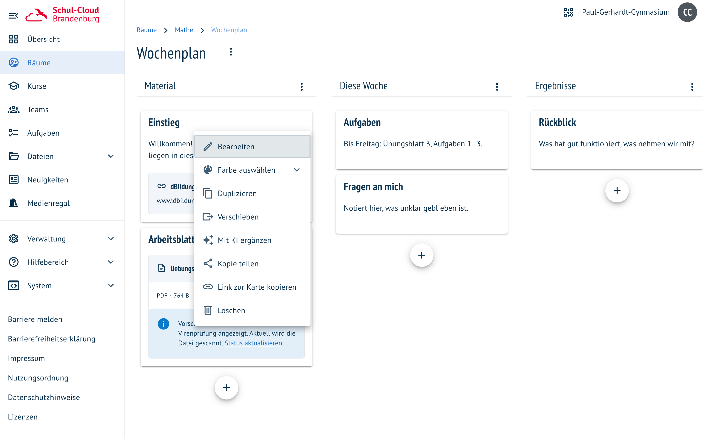
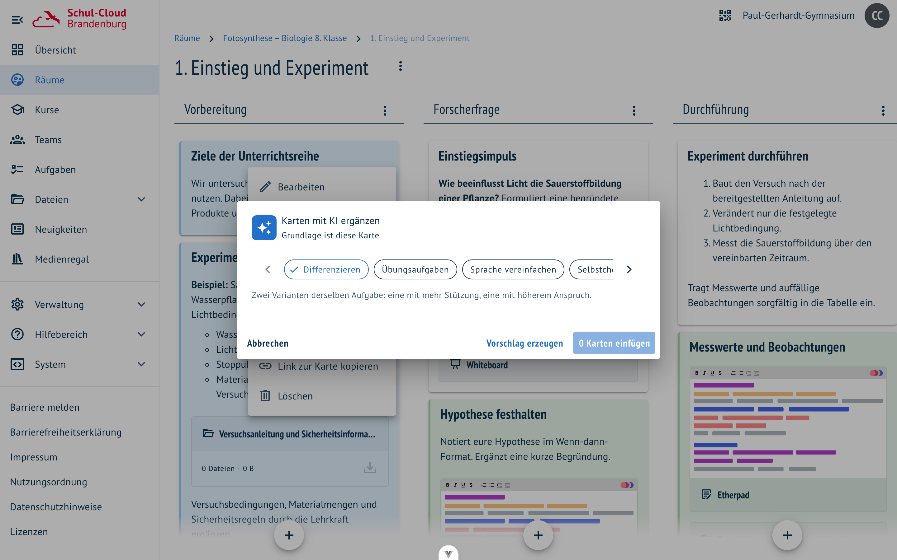
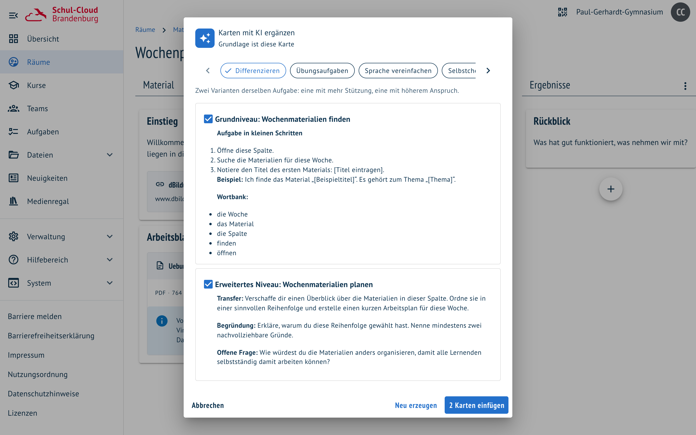
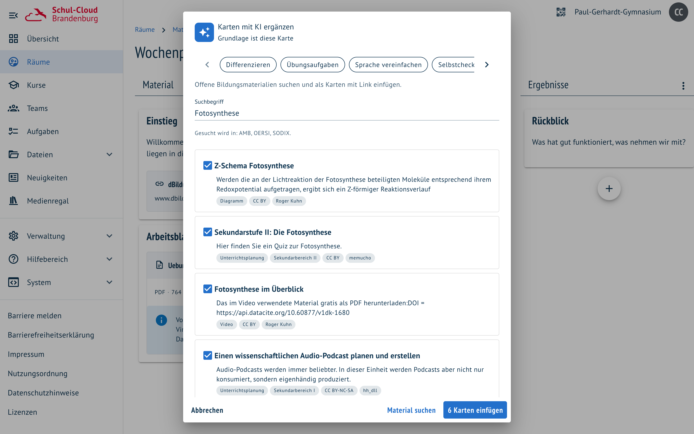

# Karten mit KI ergänzen

**Wo:** in einem Bereich, im Menü einer Karte oder einer Spalte · **Voraussetzung:**
`FEATURE_BOARD_AI_CARDS_ENABLED` und ein hinterlegter Modellzugang

Ein Bereich ist angelegt, die erste Karte steht — und jetzt fehlt die zweite Fassung für die
Gruppe, die mehr Zeit braucht. Genau dafür ist „Mit KI ergänzen" da.

## Die fünf Presets

| Preset | Was entsteht |
| --- | --- |
| **Differenzieren** | zwei Fassungen derselben Aufgabe: eine mit Teilschritten, Beispiel und Wortspeicher, eine mit Transfer und Begründung |
| **Übungsaufgaben** | Aufgaben mit steigender Schwierigkeit, dazu eine Karte mit Lösungshinweisen |
| **Sprache vereinfachen** | derselbe Inhalt in kurzen Sätzen, Fachbegriffe erklärt — für DaZ und inklusiven Unterricht |
| **Selbstcheck** | „Das kann ich jetzt …"-Aussagen zum Selbstprüfen plus kurze Antworten |
| **Freie Eingabe** | was du beschreibst, z. B. „drei Exit-Ticket-Fragen zum Inhalt" |

Grundlage ist das, worauf du zeigst: Im **Kartenmenü** liest die KI genau diese Karte, im
**Spaltenmenü** alle Karten der Spalte. Der Vorschlag wächst beim Schreiben mit.

## Material finden

Das sechste Preset fragt kein Modell, sondern einen Katalog: die **offenen Bildungsmaterialien aus
AMB, OERSI und SODIX**. Der Suchbegriff ist mit dem Kartentitel vorbelegt und lässt sich ändern.

Jeder Treffer zeigt, was man zur Beurteilung braucht: **Art des Materials, Bildungsstufe, Lizenz und
Anbieter** — so weit die Quelle das angibt; fehlende Angaben bleiben einfach weg. Übernommene Treffer
werden Karten mit Beschreibung, Lizenzangabe und Link auf die Quelle.

> Ein Suchwort trifft besser als ein ganzer Satz: „Fotosynthese" liefert bessere Ergebnisse als
> „Fotosynthese Sekundarstufe I", weil die Volltextsuche sonst auf „Sekundarstufe" anspringt.

Gesucht wird in **drei Katalogen zugleich**, und sie decken Unterschiedliches ab:

| Katalog | Stärke |
| --- | --- |
| **SODIX** | Schulmaterial mit Bildungsstufe und Fach — Landesmedienzentren, Siemens Stiftung, Verlage |
| **OERSI** | schulfachliche Begriffe wie „Fotosynthese" oder „Bruchrechnen", oft Videos und Skripte |
| **AMB** | allgemeine und hochschulnahe Themen; bei Schulbegriffen häufig ohne Treffer |

Die Trefferliste nimmt abwechselnd aus allen dreien, damit kein Katalog die anderen verdrängt.

## Nichts passiert ohne Zustimmung

- Der Vorschlag steht im Dialog, das Board bleibt unverändert.
- **Jede Karte hat ein Häkchen** — was nicht passt, wird abgewählt.
- Erst „n Karten einfügen" legt die ausgewählten Karten am Ende der Spalte an.
- Bestehende Karten werden nie überschrieben, auch nicht bei „Sprache vereinfachen": Die einfachere
  Fassung entsteht als zusätzliche Karte.

## Gut zu wissen

- Der Eintrag erscheint nur, wenn du in diesem Bereich Karten anlegen darfst.
- Höchstens sechs Karten pro Vorschlag, drei Inhalte pro Karte.
- Vorgeschlagene Links werden vor dem Anzeigen geprüft; tote Adressen fallen weg.

Verwandt: [Raum-Vorlagen](raum-vorlagen.md) · [Raum mit KI erstellen](raum-mit-ki.md)
