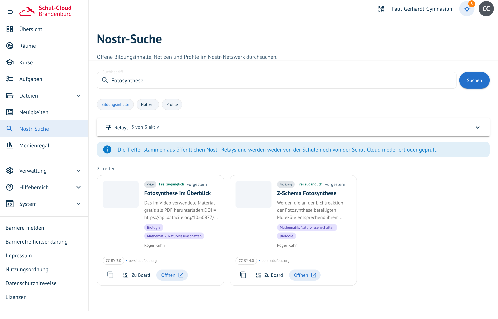
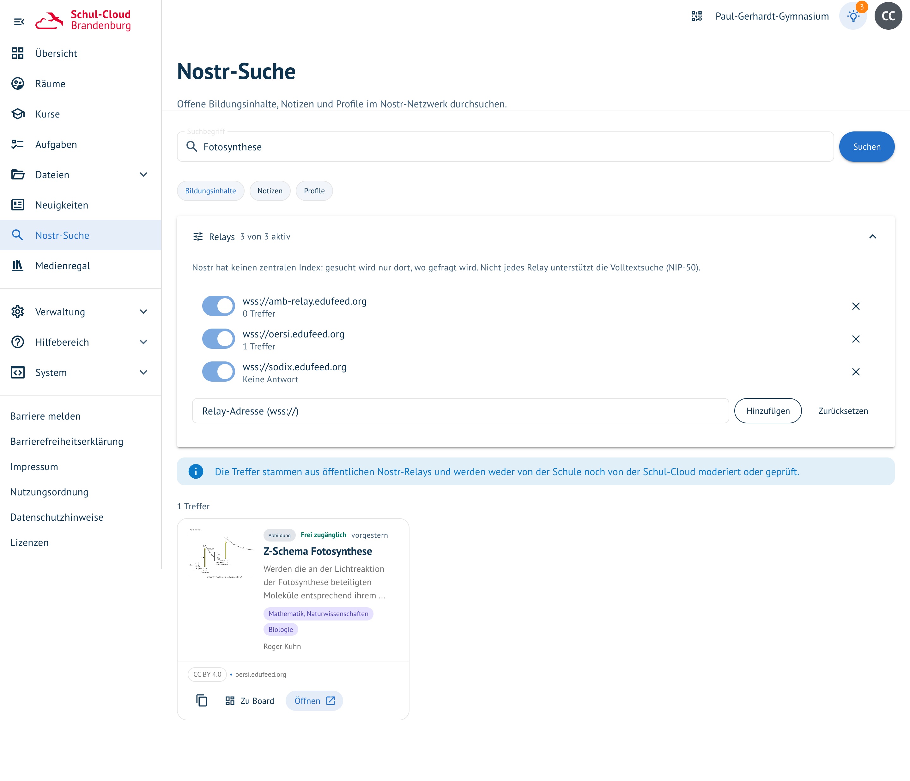

# Nostr-Suche

**Wo:** in der linken Navigation → „Nostr-Suche" · **Status:** neu, ohne Feature-Schalter

Eine eigene Seite, um offene Bildungsinhalte direkt im Nostr-Netzwerk zu durchsuchen — unabhängig
vom Board, ohne Umweg über ein Modell.

## Drei Arten von Treffern

| Modus | Was gesucht wird |
| --- | --- |
| **Bildungsinhalte** | Materialbeschreibungen nach dem AMB-Standard: Titel, Fach, Lizenz, Link |
| **Notizen** | öffentliche Beiträge im Netzwerk |
| **Profile** | Personen und Einrichtungen, die dort veröffentlichen |

Jeder Treffer zeigt Art, Lizenz, Fach, Anbieter und aus welchem Relay er stammt. Drei Aktionen
stehen an der Karte: **Öffnen** führt zur Originalquelle, **ID kopieren** gibt die Nostr-Adresse
weiter, und **Zu Board** legt den Treffer als Karte in einem Raum ab — Raum und Bereich wählt man im
Dialog.

## Die Relays sind einstellbar

Nostr hat keinen zentralen Index: **Gesucht wird nur dort, wo gefragt wird.** Voreingestellt sind
die drei edufeed-Relays — AMB, OERSI und SODIX. Die Liste lässt sich ändern: ein- und ausschalten,
eigene `wss://`-Adressen ergänzen, zurücksetzen. Die Einstellung bleibt im Browser, sie gilt also
pro Gerät und nicht für die ganze Schule.

Der Bereich zeigt nach jeder Suche, was jedes Relay geliefert hat — Trefferzahl, **keine
Volltextsuche (NIP-50)**, oder eben *nicht erreichbar*, *keine Antwort*, *Anfrage abgelehnt*. Dass
eine Quelle stumm bleibt, ist im Netzwerk normal; die Seite verschweigt es nicht.

## Was zu beachten ist

- **Die Inhalte sind nicht moderiert.** Die Seite sagt das selbst als Hinweis über der Trefferliste:
  weder Schule noch Schul-Cloud prüfen, was aus den Relays kommt.
- **Nicht jedes Relay kann Volltextsuche.** NIP-50 ist optional; ein Relay ohne diese Erweiterung
  beantwortet die Anfrage trotzdem, nur eben nicht passend. Solche Antworten werden aussortiert und
  als „keine Volltextsuche" gemeldet statt stillschweigend die Liste zu füllen.
- **Was in eine Karte übernommen wird, ist Text, kein fremdes Markup** — Inhalte aus Relays werden
  beim Anlegen entschärft.

## Unterschied zur Materialsuche im Board

Beide fragen dieselben Kataloge, aber auf verschiedenen Wegen:

| | Nostr-Suche (diese Seite) | [Material finden](board-ki-karten.md#material-finden) |
| --- | --- | --- |
| Einstieg | eigene Seite in der Navigation | Menü einer Karte oder Spalte |
| Verbindung | der Browser spricht direkt mit den Relays | der Server fragt über den AMB-Dienst |
| Relays | pro Gerät einstellbar | zentral konfiguriert |
| Umfang | Bildungsinhalte, Notizen, Profile | nur Bildungsmaterial |

Zum Stöbern und Nachschlagen die Seite, zum Bestücken einer konkreten Karte der Weg im Board.

Verwandt: [Karten mit KI ergänzen](board-ki-karten.md) · [Raum-Vorlagen](raum-vorlagen.md)
