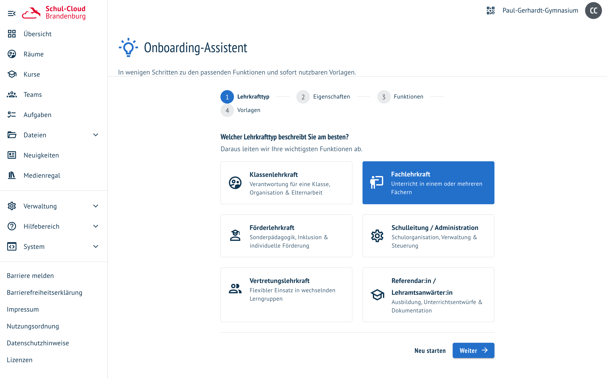
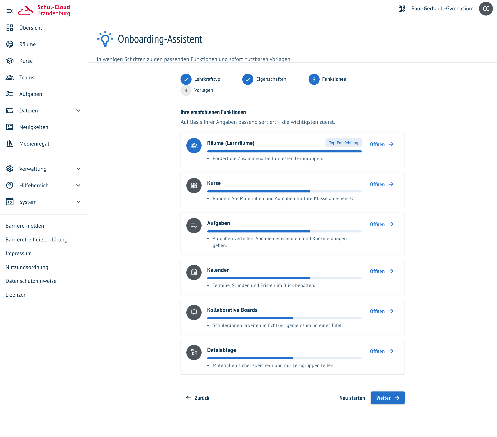
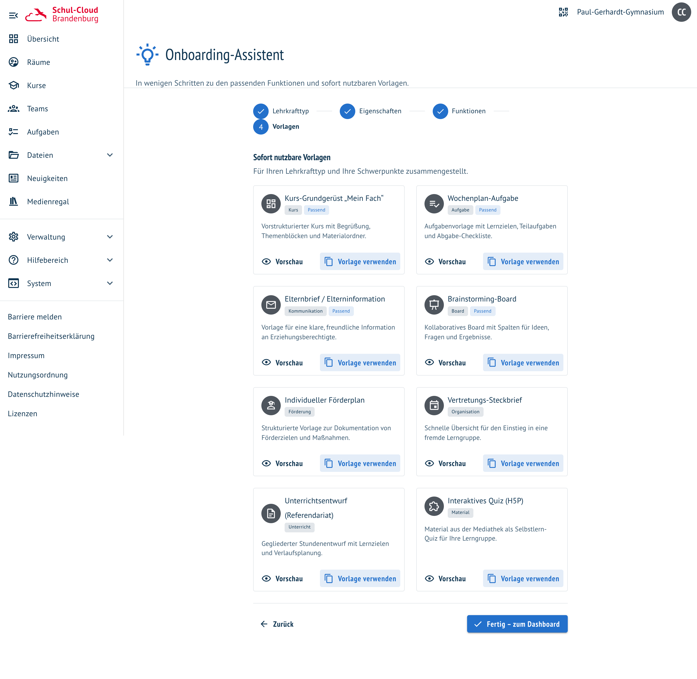

# Onboarding-Assistent

**Wo:** Übersicht → „Onboarding-Assistent", oder im Benutzermenü oben rechts ·
**Status:** Prototyp, noch nicht ausgerollt

Wer neu dazukommt, sieht eine Software mit vielen Funktionen und keinen Hinweis darauf, welche davon
für den eigenen Unterricht zählen. Der Assistent stellt vier Fragen und macht daraus eine sortierte
Empfehlung — statt einer Tour, die alles zeigt und nichts einordnet.

## Vier Schritte

| Schritt | Was gefragt wird |
| --- | --- |
| **Lehrkrafttyp** | Klassen-, Fach-, Förder-, Vertretungslehrkraft, Schulleitung oder Referendariat |
| **Eigenschaften** | Schulform, digitale Erfahrung und bis zu sechs Schwerpunkte |
| **Funktionen** | die sechs passendsten aus zehn — mit Begründung, nicht nur mit Namen |
| **Vorlagen** | acht Textvorlagen, nach Rolle und Schwerpunkten sortiert |

Der Lehrkrafttyp ist vorbelegt: Wer als Lehrkraft angemeldet ist, startet bei „Fachlehrkraft", wer
Administrationsrechte hat, bei „Schulleitung". Ändern kann man das im ersten Schritt.

## Wie die Reihenfolge zustande kommt

Ein Punktesystem, kein Modell. Jede Funktion bringt eine Grundrelevanz mit und bekommt Zuschläge:

| Angabe | Gewicht |
| --- | --- |
| Grundrelevanz der Funktion | 1–2 Punkte |
| Lehrkrafttyp | bis 3 Punkte |
| jeder gewählte Schwerpunkt | bis 3 Punkte, sie addieren sich |
| digitale Erfahrung | bis 2 Punkte |
| Schulform | 1 Punkt |

Der Balken zeigt den Abstand zur Spitzenempfehlung. Die Begründungen darunter sind vorformulierte
Sätze, die an derselben Stelle hinterlegt sind wie die Punkte — deshalb sind sie nachvollziehbar und
immer gleich, aber sie lernen auch nichts dazu.

## Vorlagen zum Mitnehmen

Acht fertige Texte, vom Kurs-Grundgerüst über den Elternbrief bis zum Unterrichtsentwurf fürs
Referendariat. „Vorschau" zeigt den vollständigen Text, „Vorlage verwenden" **kopiert ihn in die
Zwischenablage** — angelegt wird nichts, man fügt den Text dort ein, wo man ihn braucht.

## Was der Prototyp noch nicht tut

- **Nichts wird gespeichert.** Jeder Aufruf beginnt bei Schritt eins; die Antworten verlassen den
  Browser nicht und liegen nach dem Schließen nicht mehr vor.
- **Nichts wird angelegt.** Die Vorlagen sind Text für die Zwischenablage, keine fertigen Kurse oder
  Aufgaben — anders als die [Raum-Vorlagen](raum-vorlagen.md), die echte Struktur erzeugen.
- **Kein Feature-Flag.** Die Seite hängt an keinem Schalter: Sobald der Stand ausgeliefert ist, ist
  sie über Übersicht und Benutzermenü für alle erreichbar.
- **Der Katalog steht im Frontend.** Zehn Funktionen und acht Vorlagen sind fest hinterlegt; neue
  Einträge brauchen eine Codeänderung, keine Pflegeoberfläche.

Verwandt: [Raum-Vorlagen](raum-vorlagen.md) · [Raum mit KI erstellen](raum-mit-ki.md) ·
[Karten mit KI ergänzen](board-ki-karten.md)
