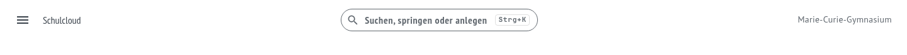
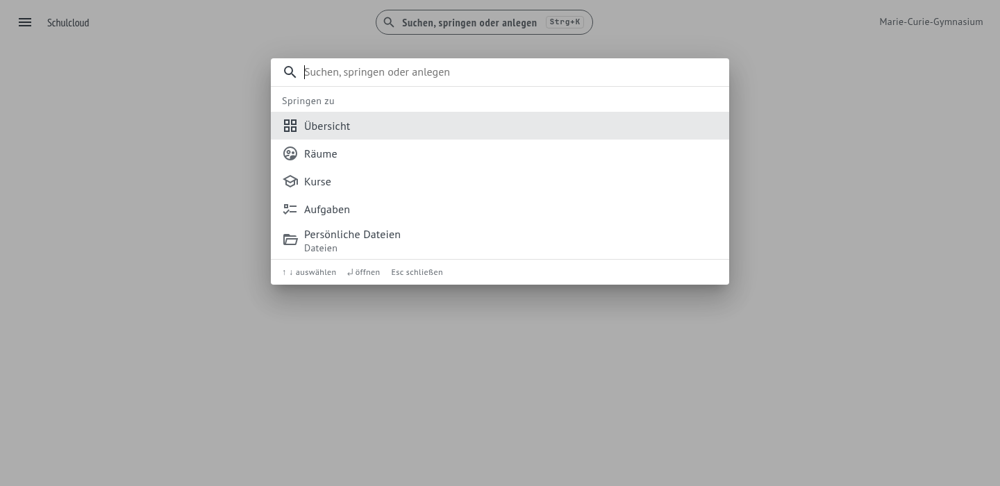
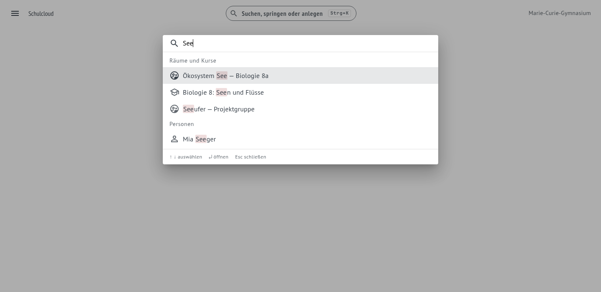
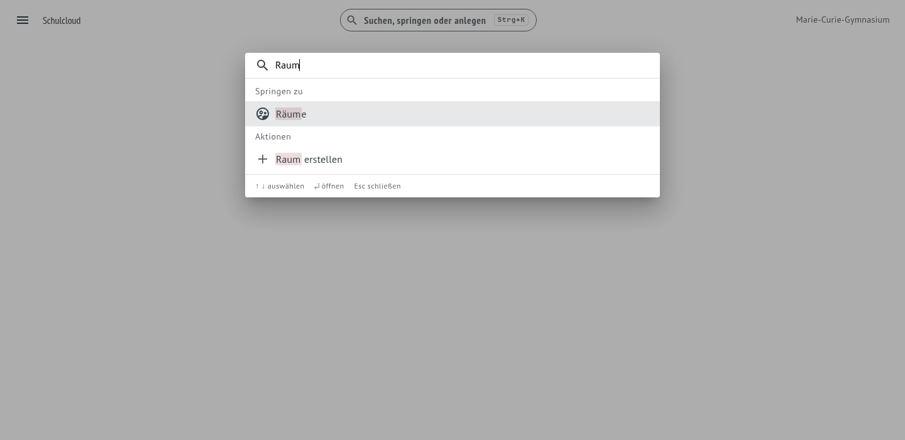
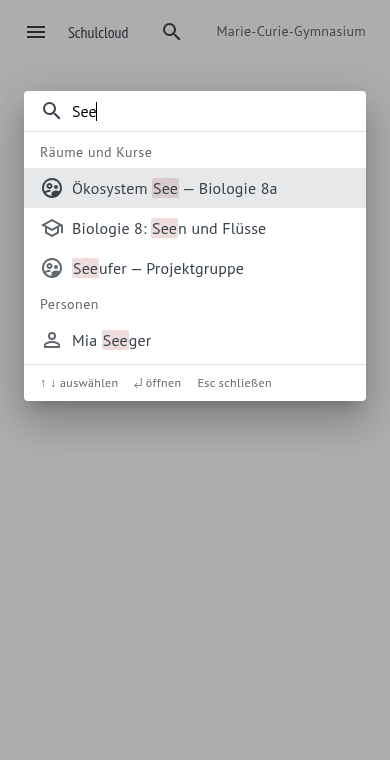

# Quick Navigation

**Wo:** überall — Kopfzeile oder <kbd>Strg</kbd>+<kbd>K</kbd> bzw. <kbd>⌘</kbd>+<kbd>K</kbd> · **Für wen:** alle

Um in einen Raum zu kommen, ging es bisher über die Seitenleiste in eine Übersicht und dort in eine
Liste. Die Quick Navigation macht daraus einen Schritt: Tastenkürzel, tippen, Enter.

## Was im Feld steht

Schon vor dem ersten Tastendruck stehen Sprungziele bereit — die Seiten, die auch in der
Seitenleiste stehen, und nur die, die man sehen darf.

Beim Tippen kommen **Räume, Kurse und Personen** dazu. Sie stammen aus einer einzigen Anfrage an den
Server und sind auf das beschränkt, worauf man ohnehin Zugriff hat: Personen erscheinen nur, wenn
man einen Raum mit ihnen teilt. Der Treffer ist hervorgehoben, damit erkennbar bleibt, *warum* eine
Zeile dasteht.

Die Trefferarten werden verschränkt: Wer vierzig Räume hat, sieht trotzdem einen Kurs und eine
Kollegin in den ersten Zeilen, statt vierzig Räume und dann nichts mehr.

## Umlaute muss man nicht treffen

„raume" findet „Räume", „okosystem" findet „Ökosystem", „muller" findet „Müller". Das gilt für die
Sortierung **und** für die Hervorhebung — im Bild unten ist „Räum" markiert, obwohl „Raum" getippt
wurde.

## Anlegen statt nur finden

Was man oft beginnt, steht mit in der Liste. Auch hier gilt die Berechtigung: Wer keine Räume
anlegen darf, bekommt „Raum erstellen" nicht angeboten.

## Tastatur und kleine Bildschirme

<kbd>↑</kbd> <kbd>↓</kbd> auswählen, <kbd>↵</kbd> öffnen, <kbd>Esc</kbd> schließen — die Auswahl
läuft am Ende der Liste oben weiter. Unter Tablet-Breite wird das Feld zu einem Lupen-Symbol, die
Palette selbst füllt die Breite.

## Grenzen dieses Stands

Es ist ein Proof of Concept:

- **Kein Material.** Im Schulcloud-3.0-Prototyp fand dieselbe Zeile auch Medien aus SODIX und
  Bildungslogin und beantwortete Fragen. Beides ist hier nicht angebunden.
- **Keine zuletzt besuchten Einträge.** Ohne Eingabe gibt es nur die ersten fünf Sprungziele.
- **Keine Boards, keine Aufgaben.** Der Endpunkt liefert bisher Räume, Kurse und Personen.
- **Suche in der Anwendung, nicht in der Datenbank.** Für die Mitgliedschaften einer Person reicht
  das; ein echter Suchindex wäre der nächste Schritt.

Die Bilder auf dieser Seite entstanden gegen eine Testumgebung mit Beispieldaten, nicht gegen den
lokalen Stack — die Palette zeigt echte Komponenten, die Räume und Personen darin sind erfunden.
