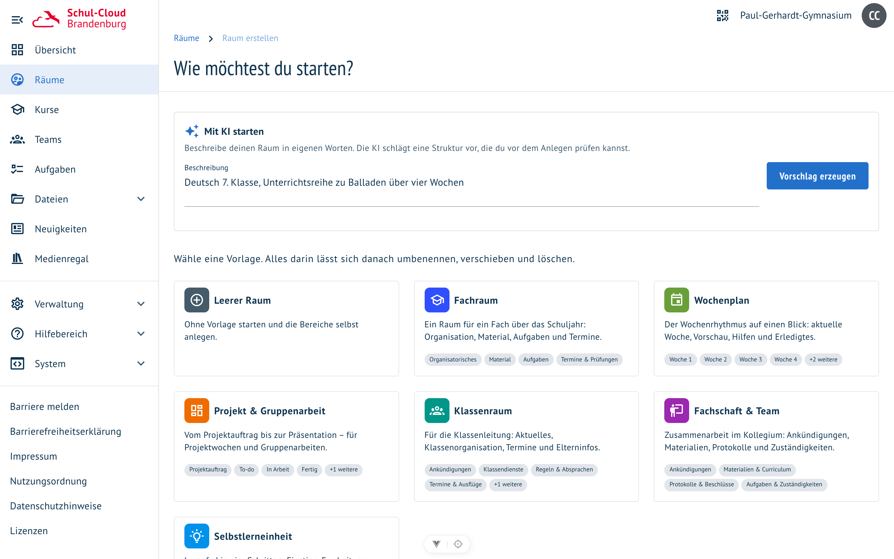

# Raum mit KI erstellen

**Wo:** Räume → „Raum erstellen" · **Voraussetzung:** `FEATURE_ROOM_AI_TEMPLATE_ENABLED` und ein
hinterlegter Modellzugang

Wenn keine der [Vorlagen](raum-vorlagen.md) passt, beschreibt man den Raum in eigenen Worten. Die KI
schlägt eine Struktur vor — und man sieht beim Schreiben zu.

## Ablauf

1. **Beschreiben** — Fach, Klassenstufe, Thema, Zeitraum, gewünschte Phasen. Je konkreter, desto
   passender der Vorschlag.
2. **Zusehen** — die vorgeschlagenen Bereiche, Spalten und Karten erscheinen einzeln, sobald das
   Modell sie geschrieben hat. Kein Warten auf ein fertiges Ergebnis.
3. **Prüfen** — der Vorschlag steht als Struktur da, bevor irgendetwas angelegt wird. „Verwerfen"
   führt zurück zur Galerie, „Übernehmen" in das gewohnte Formular.
4. **Anlegen** — Name und Farbe wie immer bestätigen; danach baut sich der Raum sichtbar auf.

## Was ein Vorschlag enthält

Dieselben Bausteine wie die kuratierten Vorlagen: Bereiche mit Spalten und Karten, Texte mit
Platzhaltern, Dateiordner, Whiteboards, gemeinsame Dokumente, farbige Karten — und **Querverweise
zwischen den Bereichen**, etwa „Weiter zur Erarbeitung" auf dem Einstiegs-Board.

Externe Links schlägt die KI nur zu Quellen vor, die sie kennt; jeder Link wird vor dem Anzeigen
einmal geprüft und fällt weg, wenn er ins Leere zeigt. Für gezielte Materialsuche gibt es die
[Materialsuche im Board](board-ki-karten.md#material-finden).

## Grenzen, die eingebaut sind

- höchstens 4 Bereiche, 6 Spalten je Bereich, 8 Karten je Spalte, 4 Elemente je Karte
- keine erfundenen Daten, Namen oder Noten — dort stehen Platzhalter
- nur öffentliche `https`-Adressen als Links
- der Vorschlag ändert nichts: Er wird erst beim Speichern zu einem Raum

## Gut zu wissen

- Die Antwort kommt in der Sprache, in der du fragst.
- Alles ist danach normal bearbeitbar — die KI liefert einen Startpunkt, kein Endergebnis.
- Dauert die Erzeugung ungewöhnlich lange, liegt es am Modell; die Anfrage hat zwei Minuten Zeit.

Verwandt: [Raum-Vorlagen](raum-vorlagen.md) · [Karten mit KI ergänzen](board-ki-karten.md)
