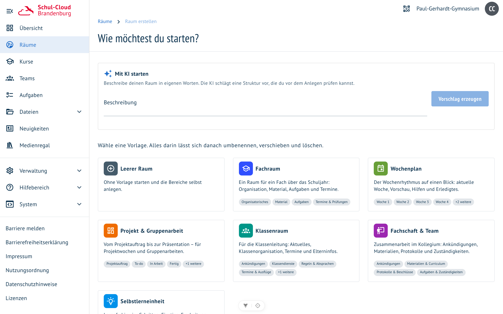
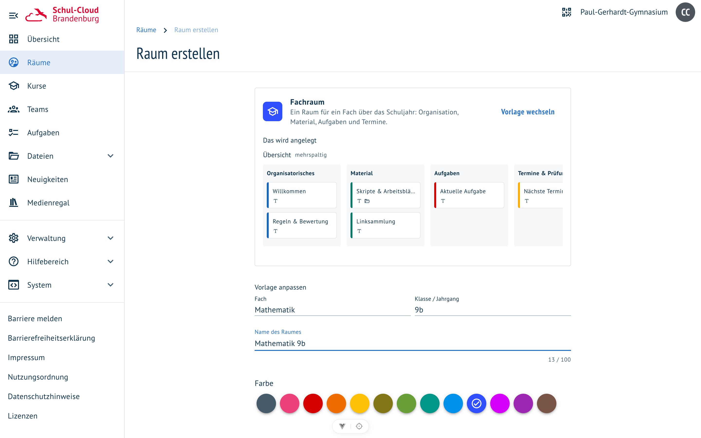

# Raum-Vorlagen

**Wo:** Räume → „Raum erstellen" · **Für wen:** alle, die Räume anlegen dürfen

Ein neuer Raum war bisher leer. Jetzt beginnt das Anlegen mit einer Galerie fertiger Strukturen —
wie in Miro oder Padlet, nur auf Unterricht zugeschnitten.

## Die sieben Vorlagen

| Vorlage | Struktur |
| --- | --- |
| **Leerer Raum** | wie bisher: nichts vorgegeben |
| **Fachraum** | Organisatorisches · Material · Aufgaben · Termine & Prüfungen |
| **Wochenplan** | eine Spalte pro Woche, dazu Material & Hilfen und Erledigt |
| **Projekt & Gruppenarbeit** | Projektauftrag · To-do · In Arbeit · Fertig · Ergebnisse, eine Karte pro Gruppe |
| **Klassenraum** | zwei Bereiche: „Aktuelles" und „Klassenorganisation", die aufeinander verweisen |
| **Fachschaft & Team** | Ankündigungen · Materialien & Curriculum · Protokolle · Zuständigkeiten |
| **Selbstlerneinheit** | Lernpfad: Einstieg · Erarbeitung · Übung · Sicherung |

## Anpassen statt hinnehmen

Nach der Auswahl zeigt der zweite Schritt, **was genau entsteht**, und darunter die Parameter der
Vorlage. Wer „Fach" und „Klasse" ändert, ändert damit den Raumnamen, die Bereichstitel und die
Texte auf den Karten — die Vorschau zieht sofort nach.

Zwei Parameter vervielfältigen sogar Struktur: **Anzahl Wochen** im Wochenplan erzeugt eine Spalte
pro Woche, **Anzahl Gruppen** im Projekt eine Karte pro Gruppe.

## Was in den Karten steckt

Die Vorlagen liefern nicht nur Überschriften. Je nach Zweck enthalten Karten

- **Text** mit Leitfragen und Platzhaltern statt erfundener Inhalte,
- **Dateiordner** für Material, Abgaben, Elternbriefe oder Protokolle,
- **Whiteboards** zum Ideensammeln,
- **gemeinsame Textdokumente** für Gruppenarbeit,
- **Verweise auf andere Bereiche** desselben Raums,
- **Kartenfarben** als Markierung: rot für Aufgaben, blau für Material, grün für Ergebnisse.

## Gut zu wissen

- Alles ist ganz normaler Rauminhalt: umbenennen, verschieben, löschen wie von Hand angelegt.
- Die Bereiche sind sofort sichtbar — kein Entwurfszustand, den man erst veröffentlichen muss.
- Beim Anlegen zeigt eine Fortschrittsansicht, was schon im Raum ist.
- Der vorgeschlagene Raumname folgt den Parametern, solange du ihn nicht selbst überschreibst.

Verwandt: [Raum mit KI erstellen](raum-mit-ki.md) · [Karten mit KI ergänzen](board-ki-karten.md)
